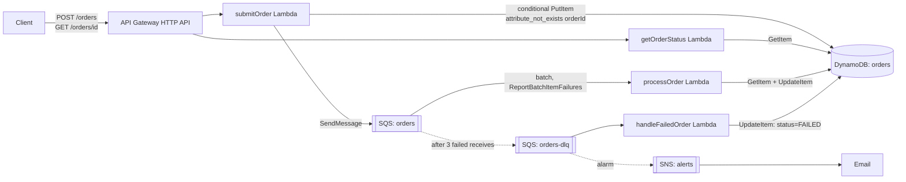

# Architecture

## Why this shape

**API Gateway (HTTP API) → Lambda → SQS → Lambda → DynamoDB**, fully serverless.

- **Async by construction.** `submitOrder` never calls downstream processing directly —
  it writes the order and enqueues it. Order submission stays available even if
  `processOrder` or its downstream dependency is completely down; messages just
  queue up in SQS instead of failing the client's request.
- **Idempotency via DynamoDB conditional writes**, not a separate dedupe table.
  `PutItem` with `ConditionExpression: attribute_not_exists(orderId)` means a retried
  submission is detected in the same write that would create the record — no race
  window, no extra round trip.
- **Bursts absorbed by SQS**, not by over-provisioning Lambda/DynamoDB. The queue
  decouples arrival rate from processing rate; `processOrder` drains it at whatever
  pace DynamoDB/downstream can sustain. DynamoDB is on-demand billing, so it scales
  with the burst instead of needing pre-provisioned capacity for a 100 req/s spike
  that's mostly not happening.
- **Partial-batch failure reporting** (`ReportBatchItemFailures`) means one bad
  message in a batch of 5 doesn't cause the other 4 to be needlessly retried.
- **DLQ + a dedicated consumer**, not just a dead pile of unprocessed messages. After
  3 failed attempts a message moves to `orders-dlq`, which itself triggers
  `handleFailedOrder` — so a permanently-failing order is proactively marked `FAILED`
  with a reason, rather than silently stuck.
- **`simulateFailure` lives on the DynamoDB record, not in the SQS message body.**
  This is what makes the recovery demo work: flipping the flag on the record and
  redriving the DLQ message re-reads current state instead of replaying a frozen
  "always fails" payload. See [runbook.md](runbook.md).

## What's deliberately not here

- No ALB/NAT Gateway/always-on compute — nothing to pay for at idle.
- No API key/auth layer — out of scope per the exercise (business logic is
  intentionally simple); would add API Gateway authorizers + Cognito or similar
  before this touched real traffic.
- No multi-region, no VPC. Lambda/API Gateway/DynamoDB/SQS are all regional
  managed services; a VPC would only add a NAT Gateway cost and complexity for
  no benefit at this scope.
